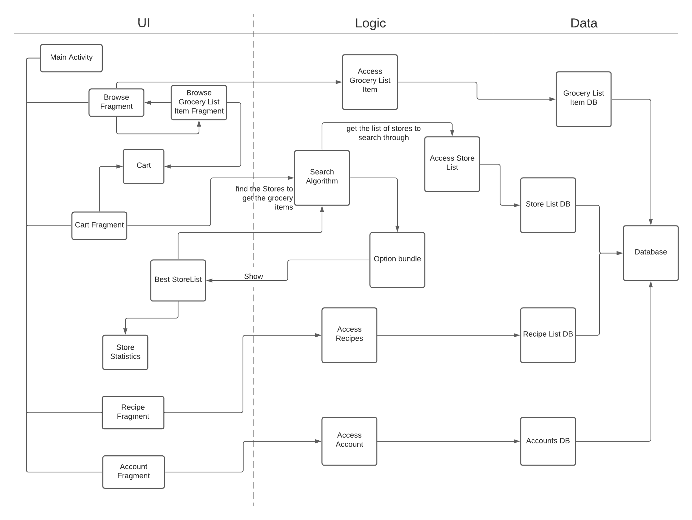

1. UI
    - Activity Classes - MainActivity, BestStoreList: Responsible for launching the search, displaying the correct fragments and displaying the widgets correctly
    - Fragment Classes - CartFragment, Browse Fragment,  BrowseGroceryListItemsFragment, Account Fragment, Recipe Fragment, StoreStatistics: Responsible for correctly displaying their widgets 
    - All Adapters - BrowseGroceryListItemsAdapter, StoreStatisticsAdapter, Best Store Adapter, Cart Adapter, Browse Adapter: Responsible for displaying the UI for our recyclerViews
2. Logic
    - SearchAlgorithm: Searches for all the possible combinations of stores to shop at, will have a static grand list that stores this list of combinations. This class also has the filter functions to filter out the list based on a selected filter option, and then sort it.
    - OptionBundle: A class which bundles a combination of ShopOptions, keeping track of its total price, average reviews, maximum distance, and whether or not it contains a local store.
    - Cart: Enables the user to edit (add,delete,etc.) their grocery list
    - AccessStoreList: Grants access to our list of Stores database
    - AccessGroceryListItem: Grants access to our grocery list items database
    - AccessRecipes: Stores all recipes that we have 
    - AccessAccount: Stores all accounts that we have(added in the future)

3. Data
    - Database: Fills out the information for our data
    - GroceryListItemDB: Stores our grocery list items 
    - StoreListDB: Stores our store list 
    - AccountDB: Stores our accounts (added in the future)
    - RecipeListDB: Stores our recipes

Architecture Diagram:

