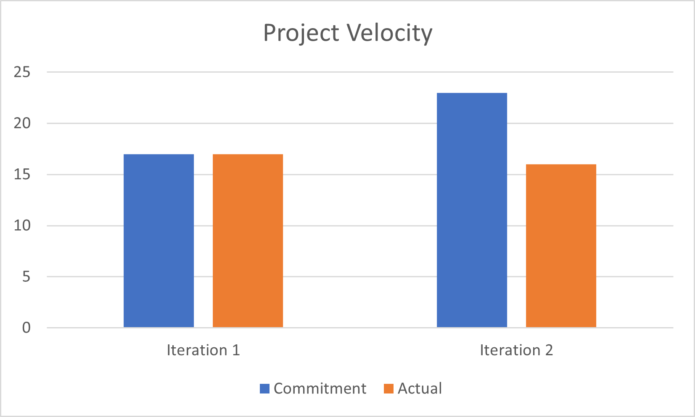

## RETROSPECTICE

The chart showing the 2 data points of project velocity from the last two iterations:

We didn’t take into account the workload for each feature when we were planning which features we want to accomplish during each iteration, 
we were focusing on the priority only. Due to having more workload in the second iteration and trying to finish all the features as soon as we can in iteration 1, 
we are left with fixing more bugs during the second iteration. Thus, we could not complete all the commitments in interation 2. This could be improved in iteration 3 by estimating
the workload with more considerations such as the time that we all can work on a new feature and try to do the work minimally and correctly (or polish the parts of the app from previous iterations), so that we don't leave more bugs in the app.
This improvement will be evaluated as success at the end of the iteration if the app can pass all the system tests proving that our app is working as expected and if the chart in iteration 3 has a gap between commitment and actual of at most 3 number of tasks proving that our estimation gets better.