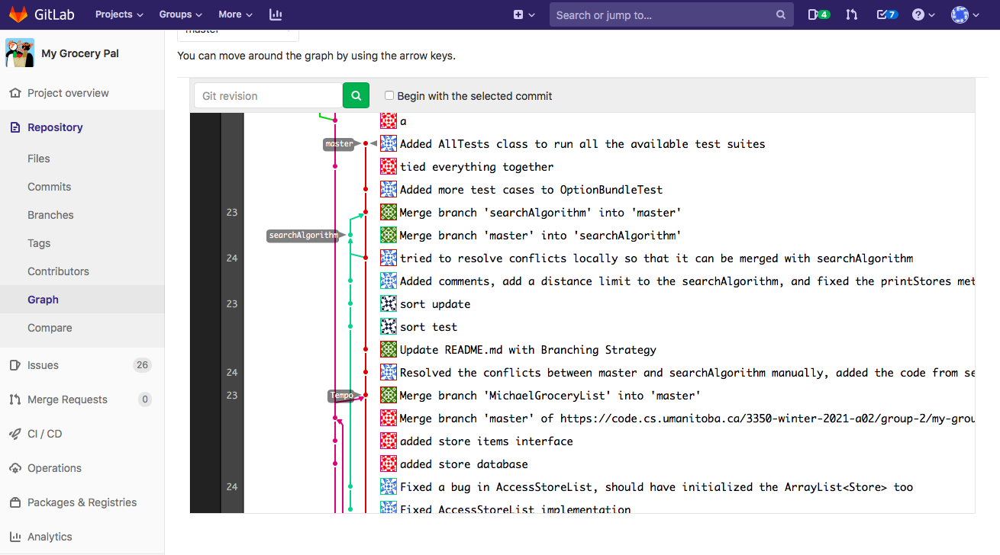

Iteration 1 Worksheet
=====================

Adding a feature
-----------------
[Feature: Find where to buy an item](https://code.cs.umanitoba.ca/3350-winter-2021-a02/group-2/my-group-pal/-/issues/1)
 
Firstly, we branch off of master to start implementing the feature and then we created a class called searchAlgorithm,  which launches the method to find the combination of stores to shop at for the provided grocery list. This is an  implementation for the “Find all the available options to shop at” user story. To help the searchAlgorithm, two classes  were created, namely ShopOption and OptionBundle. One of them keeps the reference to a store and a ref to the grocery  item, while the latter of them stores an arrayList of Shop options. This will help us to achieve the “View results  quickly” user story. Every change being made to these implementations got added to the branch with a meaningful commit  message. Finally, we merge the searchAlgorithm with the master branch when the members have reviewed our code and we    ensure that the implementation is working correctly.
 
[Related User Stories](https://code.cs.umanitoba.ca/3350-winter-2021-a02/group-2/my-group-pal/-/issues?scope=all&utf8=%E2%9C%93&state=closed&label_name[]=Feature%231)
 
[Merge Request](https://code.cs.umanitoba.ca/3350-winter-2021-a02/group-2/my-group-pal/-/merge_requests/12)
 
[Associated tests for finding where to buy an item feature](https://code.cs.umanitoba.ca/3350-winter-2021-a02/group-2/my-group-pal/-/blob/master/app/src/test/java/com/example/myapplication/Logic/SearchAlgoTest.java)
 
[Merge commit to complete the feature](https://code.cs.umanitoba.ca/3350-winter-2021-a02/group-2/my-group-pal/-/commit/92c93fb4427c660fa6424f6a7af96fd413973fa5)

Exceptional code
----------------

[Exceptional Code Testing](https://code.cs.umanitoba.ca/3350-winter-2021-a02/group-2/my-group-pal/-/blob/MichaelGroceryList/app/src/test/java/com/example/myapplication/Logic/ExceptionTest.java)  

The code is modified in such a way that when a user tries to add,   delete or update a NULL Object, it generates an exception, which is  handled by the try-catch block while printing an appropriate message.  

Branching
----------
[Branching Strategy](https://code.cs.umanitoba.ca/3350-winter-2021-a02/group-2/my-group-pal/-/blob/master/README.md)  

SOLID
-----
[SOLID violation issue in Group 3](https://code.cs.umanitoba.ca/3350-winter-2021-a02/thrive/-/issues/20)

Agile Planning
--------------
Filtering the list of suggested stores by maximum distance and minimum review based on a parameter being passed from the    user were not implemented entirely. It is because we are going to show the list from the closest to the furthest  when a user chooses to filter by distance, and if they filter by review, the list is going to show from the         best-reviewed stores to the least-reviewed stores. However, the filtering idea based on a value might be carried 
 forward in the next iteration.
 
Changed/Pushed User Stories:
 
[Filter stores based on distance](https://code.cs.umanitoba.ca/3350-winter-2021-a02/group-2/my-group-pal/-/issues/17)
 
[Filter stores based on reviews](https://code.cs.umanitoba.ca/3350-winter-2021-a02/group-2/my-group-pal/-/issues/16)

